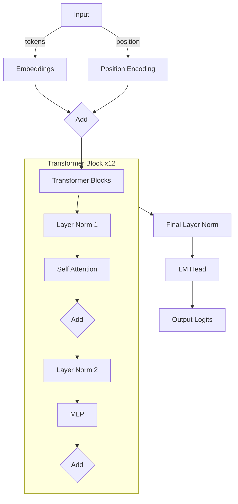

# Shakespeare-style Text Generator

This is a transformer-based language model trained on Shakespeare's text. The model can generate Shakespeare-style text continuations from any prompt.

## Usage

Enter your prompt text and adjust the generation parameters:

- Max Length: Controls how many tokens to generate
- Number of Samples: How many different continuations to generate

## Model Details

- Architecture: GPT-style transformer
- Training Data: Shakespeare's plays
- Context Length: 1024 tokens
- Model Size: ~124M (124,439,808) parameters

## Architecture Flow



### Key Components

1. **Input Processing**
   - Converts text to tokens using GPT-2 tokenizer
   - Adds positional embeddings to token embeddings

2. **Transformer Block (repeated 12 times)**
   - **Self Attention Layer**
     - Projects input into Query, Key, Value matrices
     - Computes attention scores with causal masking
     - Aggregates values based on attention weights
   - **MLP Layer**
     - Two linear transformations with GELU activation
     - Processes each position independently

3. **Output Processing**
   - Final layer normalization
   - Projects to vocabulary size through language model head
   - Generates probability distribution over next tokens

### Training Process

1. **Data Loading**
   - Loads Shakespeare text
   - Tokenizes using GPT-2 tokenizer
   - Creates batches of sequences

2. **Optimization**
   - Uses AdamW optimizer
   - OneCycleLR learning rate scheduler
   - Gradient clipping at 0.5
   - Trains until loss < 0.1

3. **Generation**
   - Takes input prompt
   - Generates multiple continuations
   - Uses temperature-controlled sampling

## [Training Logs](model_training_log_124M.log)

```
    using device: mps
    Total Parameters: 124,439,808
    Trainable Parameters: 124,439,808
    Model Size: 474.70 MB

    Size by component:
    transformer: 474.70 MB
    loaded 338025 tokens
    1 epoch = 165 batches
    Training for 20000 steps
    step 0, loss: 10.9502, avg_loss: 10.9502, best_loss: 10.9502, lr: 2.00e-05, time/batch: 0.000s
    step 100, loss: 7.3906, avg_loss: 8.3566, best_loss: 7.3123, lr: 2.11e-05, time/batch: 1.628s
    step 200, loss: 6.1753, avg_loss: 6.8555, best_loss: 6.1532, lr: 2.45e-05, time/batch: 1.831s
    step 300, loss: 5.9569, avg_loss: 6.2094, best_loss: 5.6177, lr: 2.99e-05, time/batch: 1.867s
    step 400, loss: 5.5256, avg_loss: 5.8287, best_loss: 5.3965, lr: 3.73e-05, time/batch: 8.918s
    step 500, loss: 5.7069, avg_loss: 5.6113, best_loss: 4.8180, lr: 4.65e-05, time/batch: 1.573s
    step 600, loss: 5.5649, avg_loss: 5.3132, best_loss: 4.6987, lr: 5.72e-05, time/batch: 1.781s
    step 700, loss: 5.1711, avg_loss: 5.1089, best_loss: 4.2885, lr: 6.93e-05, time/batch: 1.782s
    step 800, loss: 4.3251, avg_loss: 4.9638, best_loss: 4.2482, lr: 8.24e-05, time/batch: 1.812s
    step 900, loss: 5.0213, avg_loss: 4.7389, best_loss: 3.9379, lr: 9.61e-05, time/batch: 1.840s
    step 1000, loss: 4.3302, avg_loss: 4.6289, best_loss: 3.6702, lr: 1.10e-04, time/batch: 1.862s
    step 1100, loss: 4.6830, avg_loss: 4.4508, best_loss: 3.6702, lr: 1.24e-04, time/batch: 1.873s
    step 1200, loss: 4.3765, avg_loss: 4.3032, best_loss: 3.4492, lr: 1.38e-04, time/batch: 1.802s
    step 1300, loss: 4.2446, avg_loss: 4.2775, best_loss: 3.4492, lr: 1.51e-04, time/batch: 2.981s
    step 1400, loss: 3.8800, avg_loss: 4.0641, best_loss: 3.2410, lr: 1.63e-04, time/batch: 1.671s
    step 1500, loss: 3.7004, avg_loss: 3.9946, best_loss: 3.0554, lr: 1.74e-04, time/batch: 1.907s
    step 1600, loss: 4.2758, avg_loss: 3.9018, best_loss: 3.0554, lr: 1.83e-04, time/batch: 5.082s
    step 1700, loss: 3.8317, avg_loss: 3.7076, best_loss: 2.8623, lr: 1.90e-04, time/batch: 1.683s
    step 1800, loss: 3.4979, avg_loss: 3.6547, best_loss: 2.8623, lr: 1.96e-04, time/batch: 1.876s
    step 1900, loss: 3.3440, avg_loss: 3.4729, best_loss: 2.6924, lr: 1.99e-04, time/batch: 1.802s
    step 2000, loss: 3.3396, avg_loss: 3.3584, best_loss: 2.5123, lr: 2.00e-04, time/batch: 1.807s
    step 2100, loss: 3.4327, avg_loss: 3.2191, best_loss: 2.5123, lr: 2.00e-04, time/batch: 1.950s
    step 2200, loss: 3.1999, avg_loss: 3.0309, best_loss: 2.3588, lr: 2.00e-04, time/batch: 1.889s
    step 2300, loss: 2.5305, avg_loss: 2.8855, best_loss: 2.3542, lr: 2.00e-04, time/batch: 16.599s
    step 2400, loss: 2.4819, avg_loss: 2.7043, best_loss: 2.1018, lr: 2.00e-04, time/batch: 1.628s
    step 2500, loss: 2.2164, avg_loss: 2.5656, best_loss: 1.8639, lr: 2.00e-04, time/batch: 1.761s
    step 2600, loss: 2.5643, avg_loss: 2.3902, best_loss: 1.8639, lr: 1.99e-04, time/batch: 2.347s
    step 2700, loss: 1.9572, avg_loss: 2.1937, best_loss: 1.6151, lr: 1.99e-04, time/batch: 1.806s
    step 2800, loss: 2.2588, avg_loss: 2.0342, best_loss: 1.3980, lr: 1.99e-04, time/batch: 20.100s
    step 2900, loss: 1.8800, avg_loss: 1.8711, best_loss: 1.3750, lr: 1.99e-04, time/batch: 27.274s
    step 3000, loss: 1.6370, avg_loss: 1.7541, best_loss: 1.1940, lr: 1.98e-04, time/batch: 1.565s
    step 3100, loss: 1.3895, avg_loss: 1.5685, best_loss: 1.1639, lr: 1.98e-04, time/batch: 1.653s
    step 3200, loss: 1.4520, avg_loss: 1.4192, best_loss: 0.9917, lr: 1.98e-04, time/batch: 10.286s
    step 3300, loss: 1.6242, avg_loss: 1.3050, best_loss: 0.8502, lr: 1.97e-04, time/batch: 28.252s
    step 3400, loss: 0.8924, avg_loss: 1.1371, best_loss: 0.7913, lr: 1.97e-04, time/batch: 1.584s
    step 3500, loss: 0.8217, avg_loss: 1.0748, best_loss: 0.6891, lr: 1.97e-04, time/batch: 1.656s
    step 3600, loss: 0.8413, avg_loss: 0.9315, best_loss: 0.6021, lr: 1.96e-04, time/batch: 17.187s
    step 3700, loss: 0.6819, avg_loss: 0.8269, best_loss: 0.5222, lr: 1.96e-04, time/batch: 31.042s
    step 3800, loss: 0.9991, avg_loss: 0.7506, best_loss: 0.4588, lr: 1.95e-04, time/batch: 1.545s
    step 3900, loss: 0.7237, avg_loss: 0.6114, best_loss: 0.3816, lr: 1.95e-04, time/batch: 1.566s
    step 4000, loss: 0.5151, avg_loss: 0.6010, best_loss: 0.3762, lr: 1.94e-04, time/batch: 1.669s
    step 4100, loss: 0.4865, avg_loss: 0.5045, best_loss: 0.3141, lr: 1.93e-04, time/batch: 1.697s
    step 4200, loss: 0.4163, avg_loss: 0.4516, best_loss: 0.2661, lr: 1.93e-04, time/batch: 1.730s
    step 4300, loss: 0.3515, avg_loss: 0.4264, best_loss: 0.2591, lr: 1.92e-04, time/batch: 1.795s
    step 4400, loss: 0.3904, avg_loss: 0.3420, best_loss: 0.2481, lr: 1.91e-04, time/batch: 1.800s
    step 4500, loss: 0.3141, avg_loss: 0.3390, best_loss: 0.2341, lr: 1.91e-04, time/batch: 1.724s
    step 4600, loss: 0.3440, avg_loss: 0.3001, best_loss: 0.1881, lr: 1.90e-04, time/batch: 1.735s
    step 4700, loss: 0.2409, avg_loss: 0.2595, best_loss: 0.1705, lr: 1.89e-04, time/batch: 1.741s
    step 4800, loss: 0.2562, avg_loss: 0.2528, best_loss: 0.1705, lr: 1.88e-04, time/batch: 1.747s
    step 4900, loss: 0.2698, avg_loss: 0.2172, best_loss: 0.1486, lr: 1.87e-04, time/batch: 1.745s
    step 5000, loss: 0.1994, avg_loss: 0.2135, best_loss: 0.1384, lr: 1.87e-04, time/batch: 1.790s
    step 5100, loss: 0.1596, avg_loss: 0.2024, best_loss: 0.1384, lr: 1.86e-04, time/batch: 1.840s
    step 5200, loss: 0.1743, avg_loss: 0.1822, best_loss: 0.1255, lr: 1.85e-04, time/batch: 2.030s
    step 5300, loss: 0.1620, avg_loss: 0.1814, best_loss: 0.1203, lr: 1.84e-04, time/batch: 1.979s
    step 5400, loss: 0.1695, avg_loss: 0.1599, best_loss: 0.1120, lr: 1.83e-04, time/batch: 1.892s
    step 5500, loss: 0.1548, avg_loss: 0.1608, best_loss: 0.1120, lr: 1.82e-04, time/batch: 1.963s
    step 5600, loss: 0.1295, avg_loss: 0.1530, best_loss: 0.1120, lr: 1.81e-04, time/batch: 2.040s
    step 5700, loss: 0.1193, avg_loss: 0.1401, best_loss: 0.1059, lr: 1.80e-04, time/batch: 2.082s
    step 5800, loss: 0.1199, avg_loss: 0.1436, best_loss: 0.0907, lr: 1.79e-04, time/batch: 2.076s
    step 5900, loss: 0.1448, avg_loss: 0.1329, best_loss: 0.0907, lr: 1.78e-04, time/batch: 1.955s
    step 6000, loss: 0.1072, avg_loss: 0.1286, best_loss: 0.0907, lr: 1.77e-04, time/batch: 1.924s
    step 6100, loss: 0.1249, avg_loss: 0.1243, best_loss: 0.0907, lr: 1.75e-04, time/batch: 1.883s
    step 6200, loss: 0.1163, avg_loss: 0.1190, best_loss: 0.0838, lr: 1.74e-04, time/batch: 1.966s
    step 6300, loss: 0.1215, avg_loss: 0.1191, best_loss: 0.0838, lr: 1.73e-04, time/batch: 1.956s
    step 6400, loss: 0.1236, avg_loss: 0.1115, best_loss: 0.0800, lr: 1.72e-04, time/batch: 1.958s
    step 6500, loss: 0.1188, avg_loss: 0.1080, best_loss: 0.0800, lr: 1.71e-04, time/batch: 1.964s
    step 6600, loss: 0.1128, avg_loss: 0.1080, best_loss: 0.0740, lr: 1.70e-04, time/batch: 1.959s
    step 6700, loss: 0.0954, avg_loss: 0.1005, best_loss: 0.0740, lr: 1.68e-04, time/batch: 1.966s

    Reached target average loss of 0.099998 at step 6702
    Final loss: 0.073401
    Best loss: 0.073401
    Final average loss: 0.099998
    Model saved to trained_model.pt

```
